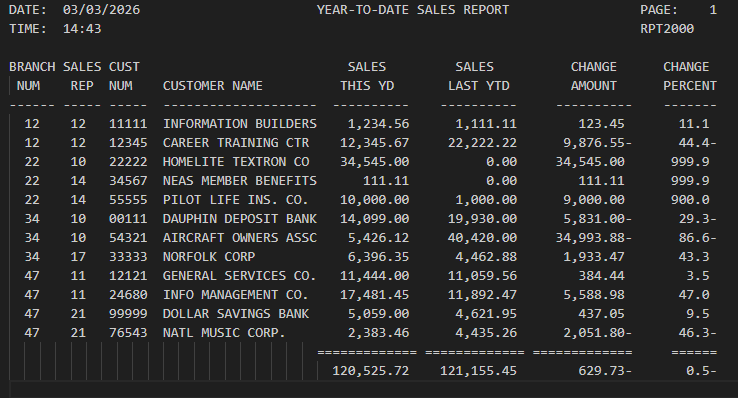

# RPT2000 (COBOL) - SALES REPORT

## Authors
[@bstearns07](https://github.com/bstearns07) Ben Stearns
[@KirbyD-YEAH](https://github.com/KirbyD-YEAH) Kirby Dunker

## Table of Contents
- [Authors](#authors)
- [Summary](#summary)
- [How Does It Work](#how-does-it-work)
- [Screenshots](#screenshots)
  - [Output](#output)
- [Topics Covered](#topics-covered)

## Summary
### Welcome to the REPORT2000 Sales Report Program!
This COBOL program demonstrates the fundamentals and reading and writing to files by generating a sales report
for a variety of customer vendors. The code provided conforms to mainframe COBOL standards for the enterprise 
mainframe environment.

## How Does It Work
In order to run this program, please do the following:
- Download the provided JCL, COBOL source code, and CUSTMAST file that contains the data this program relies on
- Add these files to your IBM mainframe environment
- Update the JCL DSN names to match the filepaths of your environment
- Submit the JCL job to your mainframe for processing

For every run, the program will:
  1. Open and read the data from the CUSTMAST file
  2. Parse the data from each line of the data file
  3. Perform needed computations for calculated fields
  4. Generate header, customer line, and final total information
  5. Write all the information to the print area for viewing

For full program details, see 
